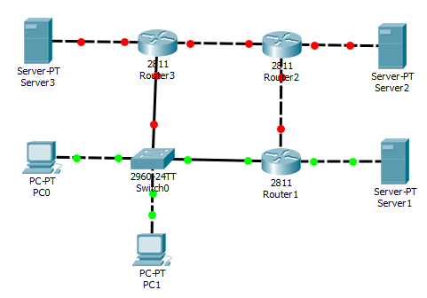
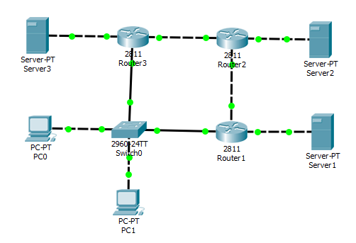
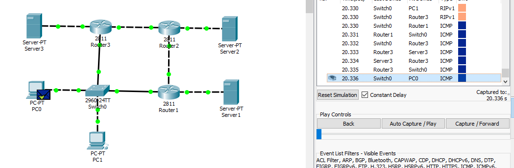

Белых Владислав, КН-202

N = 4

1. Построим сеть.

   

   Примечания: 

   1) чтобы добавить интерфейс FE 1/0, добавим к маршрутизаторам модуль NM-2FE2W

   2) на картинке у Router 1 уже подняты некоторые интерфейсы, потому что пришлось менять кабели и скрин сейвить повторно

2. Поднимем сетевые интерфейсы FE \*/\* , укажем для них IP адреса.

   Router 1

   ```
   Router>en
   Router#conf t

   Router(config)#int fast 1/0
   Router(config-if)#ip address 192.168.1.1 255.255.255.0
   Router(config-if)#no shutdown
   Router(config-if)#exit

   Router(config)#int fast 0/1
   Router(config-if)#ip address 10.4.1.1 255.255.255.0
   Router(config-if)#no shutdown
   Router(config-if)#exit

   Router(config)#int fast 0/0
   Router(config-if)#ip address 192.168.10.1 255.255.255.252
   Router(config-if)#no shutdown
   Router(config-if)#exit

   Router(config)#exit
   Router#w m
   Router#exit
   ```

   Server 1

   Назначим IP = 192.168.1.14 / 24

   Router 2

   ```
   Router>en
   Router#conf t
   Router(config)#int fast 0/0
   Router(config-if)#ip addr 192.168.10.2 255.255.255.252
   Router(config-if)#no shut
   Router(config-if)#exit

   Router(config)#int f1/0
   Router(config-if)#ip addr 192.168.2.1 255.255.255.0
   Router(config-if)#no shut
   Router(config-if)#exit

   Router(config)#int f0/1
   Router(config-if)#ip addr 192.168.10.6 255.255.255.252
   Router(config-if)#no shut
   Router(config)#exit

   Router(config)#exit
   Router#w m
   Router#exit
   ```

   Server 2

   Назначим IP = 192.168.2.14 / 24

   Router 3

   ```
   Router>en
   Router#conf t
   Router(config)#int f0/1
   Router(config-if)#ip addr 192.168.10.5 255.255.255.252
   Router(config-if)#no shut
   Router(config-if)#exit

   Router(config)#int f1/0
   Router(config-if)#ip addr 192.168.3.1 255.255.255.0
   Router(config-if)#no shut
   Router(config-if)#exit

   Router(config)#int f0/0
   Router(config-if)#ip addr 10.4.1.2 255.255.255.0
   Router(config-if)#no shut
   Router(config-if)#exit

   Router(config)#exit
   Router#w m
   Router#exit
   ```

   Server 3

   Назначим IP = 192.168.3.14 / 24

   PC0

   Назначим IP = 10.4.1.14 / 24

   PC1

   Назначим IP = 10.4.1.15 / 24

   Шлюз по умолчаю для PC0, PC1 = Router 1 (т.к. N = 4)

   ```
   Switch>en
   Switch#conf t
   Switch(config)#ip default-gateway 10.4.1.1
   Switch(config)#exit
   Switch#w m
   Switch#exit
   ```

   Итого:

   

   ​

3. Запускаем RIP.

   Router 1

   ```
   Router>en
   Router#router rip
   Router#conf t
   Router(config)#router rip
   Router(config-router)#network 192.168.1.0
   Router(config-router)#network 192.168.10.0
   Router(config-router)#network 10.4.1.0
   Router(config-router)#end
   Router#w m
   Router#exit
   ```

   Router 2

   ```
   Router>en
   Router#conf t
   Router(config)#router rip
   Router(config-router)#network 192.168.2.0
   Router(config-router)#network 192.168.10.0
   Router(config-router)#network 192.168.10.4
   Router(config-router)#end
   Router#w m
   Router#exit
   ```

   Router 3

   ```
   Router>en
   Router#conft 
   Router(config)#router rip
   Router(config-router)#network 192.168.3.0
   Router(config-router)#network 192.168.10.4
   Router(config-router)#network 10.4.1.0
   Router(config-router)#end
   Router#w m
   Router#exit
   ```

   ​

4. Пропишем gateway`и у серверов и запустим ICMP симуляцию

5. show ip route и show ip interface brief

   Router 1

   ```
        10.0.0.0/24 is subnetted, 1 subnets
   C       10.4.1.0 is directly connected, FastEthernet0/1
   C    192.168.1.0/24 is directly connected, FastEthernet1/0
   R    192.168.2.0/24 [120/1] via 192.168.10.2, 00:00:10, FastEthernet0/0
   R    192.168.3.0/24 [120/1] via 10.4.1.2, 00:00:12, FastEthernet0/1
        192.168.10.0/30 is subnetted, 2 subnets
   C       192.168.10.0 is directly connected, FastEthernet0/0
   R       192.168.10.4 [120/1] via 192.168.10.2, 00:00:10, FastEthernet0/0
   ```

   ```
   Interface              IP-Address      OK? Method Status                Protocol 
   FastEthernet0/0        192.168.10.1    YES manual up                    up 
   FastEthernet0/1        10.4.1.1        YES manual up                    up 
   FastEthernet1/0        192.168.1.1     YES manual up                    up 
   FastEthernet1/1        unassigned      YES unset  administratively down down 
   Vlan1                  unassigned      YES unset  administratively down down
   ```

   Router 2

   ```
   R    10.0.0.0/8 [120/1] via 192.168.10.1, 00:00:07, FastEthernet0/0
                   [120/1] via 192.168.10.5, 00:00:12, FastEthernet0/1
   R    192.168.1.0/24 [120/1] via 192.168.10.1, 00:00:07, FastEthernet0/0
   C    192.168.2.0/24 is directly connected, FastEthernet1/0
   R    192.168.3.0/24 [120/1] via 192.168.10.5, 00:00:12, FastEthernet0/1
        192.168.10.0/30 is subnetted, 2 subnets
   C       192.168.10.0 is directly connected, FastEthernet0/0
   C       192.168.10.4 is directly connected, FastEthernet0/1
   ```

   ```
   Interface              IP-Address      OK? Method Status                Protocol 
   FastEthernet0/0        192.168.10.2    YES manual up                    up 
   FastEthernet0/1        192.168.10.6    YES manual up                    up 
   FastEthernet1/0        192.168.2.1     YES manual up                    up 
   FastEthernet1/1        unassigned      YES unset  administratively down down 
   Vlan1                  unassigned      YES unset  administratively down down
   ```

   Router 3

   ```
        10.0.0.0/24 is subnetted, 1 subnets
   C       10.4.1.0 is directly connected, FastEthernet0/0
   R    192.168.1.0/24 [120/1] via 10.4.1.1, 00:00:07, FastEthernet0/0
   R    192.168.2.0/24 [120/1] via 192.168.10.6, 00:00:10, FastEthernet0/1
   C    192.168.3.0/24 is directly connected, FastEthernet1/0
        192.168.10.0/30 is subnetted, 2 subnets
   R       192.168.10.0 [120/1] via 192.168.10.6, 00:00:10, FastEthernet0/1
   C       192.168.10.4 is directly connected, FastEthernet0/1
   ```

   ```
   Interface              IP-Address      OK? Method Status                Protocol 
   FastEthernet0/0        10.4.1.2        YES manual up                    up 
   FastEthernet0/1        192.168.10.5    YES manual up                    up 
   FastEthernet1/0        192.168.3.1     YES manual up                    up 
   FastEthernet1/1        unassigned      YES unset  administratively down down 
   Vlan1                  unassigned      YES unset  administratively down down
   ```

   ​

